# Ablation Study: Why Does Pruning Hurt Translation Quality, and What Does LoRA Actually Do?

## TL;DR

We removed 16 of 32 layers from Aya Expanse 8B using IFR-guided pruning, then tried to understand why COMET dropped from 0.582 → 0.315 and why LoRA fine-tuning recovers it to 0.847.

**The intuition in one sentence:** The representations (what each layer *knows*) survive pruning intact; what breaks is the *routing* between them — the projections that decide how each surviving layer reads from and writes to the residual stream. LoRA FT rebuilds that routing, which is why recovery is fast (the rooms still have their contents; we just need to re-wire the doors).

**Key findings:**

1. **Representations stay grossly aligned after pruning** (matched-depth CKA > 0.99) because the base model has enormous internal redundancy (adjacent-layer CKA > 0.99 for middle layers).
2. **But "grossly aligned" isn't enough for autoregressive generation.** Subtle directional errors at every layer compound during decoding, producing wrong-language output, verbose rambling, and repetition.
3. **LoRA works because of three ingredients**: (a) distributed placement at every layer, (b) per-projection updates inside each layer's attention and MLP (not just at layer boundaries), and (c) SGD on token-level loss that sees the full autoregressive trajectory.
4. **Localized fixes fail**, even with 50× more trainable params. 4 v1 approaches (norm, linear probe, LM-head FT, last-3-MLP FT) all topped out at 0.43.
5. **Distributed-but-limited fixes also fail.** 4 v2 approaches (per-layer norms, Procrustes, rank-16 closed-form probes, bias-only FT) topped out at 0.45. Even distributing corrections across every layer isn't enough if you can't update the inner projections with gradient signal.
6. **KD is harmful here.** Authentic-data-only FT (0.847 COMET) beats FT with added Aya-32B KD data (0.813).
7. **Recovery is fast and data-efficient.** 89% of recovery happens in the first 6% of training. 25% of data gets 91% of peak COMET. Consistent with the "re-wiring not relearning" intuition.

---

## Models Compared (original experiments)

| Model | Layers | COMET | Description |
|-------|--------|-------|-------------|
| Base (no FT) | 32 | 0.582 | Raw Aya 8B |
| Pruned only (IP_16_enes) | 16 | 0.315 | IFR removed 16 middle layers |
| Pruned + FT + KD (I2_16_enes) | 16 | 0.836 | LoRA r=16 + Aya-32B KD data |
| Unpruned + FT + KD (B4_enes) | 32 | 0.893 | LoRA FT ceiling |

Layers removed by IFR: **[6, 7, 8, 9, 10, 11, 12, 13, 14, 15, 16, 17, 18, 20, 22, 23]** — almost entirely the middle of the network.

---

## Experiments Run

| # | Experiment | Purpose | Output |
|---|-----------|---------|--------|
| 1 | Hidden state divergence (cross-model CKA) | Where do representations diverge? | `hidden_state_cka_heatmaps.png`, `matched_depth_cka.png` |
| 2 | Output error categorization | What kind of errors does the pruned model make? | `output_categorization.png` |
| 3 | Logit lens | When does the model "know" its answer? | `logit_lens.png` |
| 4 | Attention comparison | Do attention patterns change after FT? | `attention_comparison.png` |
| 5 | FT recovery curve (with KD) | How fast does FT rebuild quality? | `ft_recovery_curves.png` |
| 6 | FT recovery curve (no KD) | Does KD help or hurt? | (same figure) |
| 7 | Data fraction ablation (25/50/75%) | How much data do we need? | (same figure) |
| 8 | Per-layer weight diff | Where does FT concentrate changes? | `weight_diff_per_layer.png` |
| 10 | Intra-model redundancy (pairwise CKA, effective rank) | Is the base model redundant? | `redundancy_analysis.png` |
| 11a | Surgical fixes v1 (4 localized approaches) | Can one interface point fix it? | `surgical_fix_comparison.png` |
| **11b** | **Surgical fixes v2 (4 distributed approaches)** | **What specifically does LoRA need beyond distribution?** | **`all_surgical_comparison.png`, `procrustes_error_by_layer.png`** |

---

## Finding 1: Pruning barely changes representation alignment

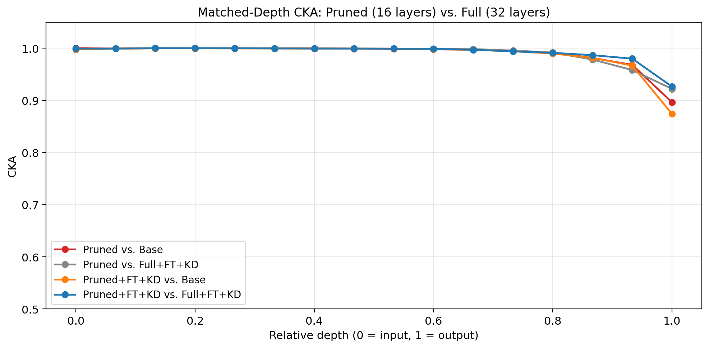

For layers at relative depths 0-0.9, the pruned model's representations are **>0.99 CKA-similar** to the base model's at matched relative depths. Only at the final layer (depth 1.0) does CKA drop — to 0.87 for pruned-vs-base.

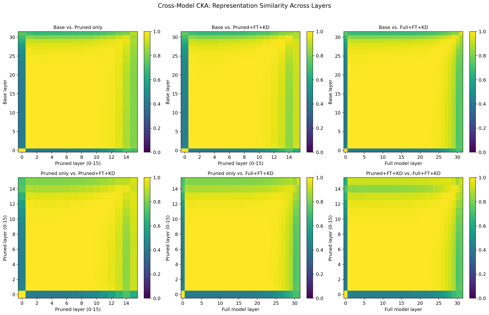

Cross-model heatmaps confirm this: every comparison is nearly uniformly yellow (CKA > 0.9) except thin dark edge bands at layer 0 and the final layer.

**Takeaway:** The 16 surviving layers carry essentially the same gross representational structure as the original 32-layer model.

---

## Finding 2: Aya 8B has massive internal redundancy

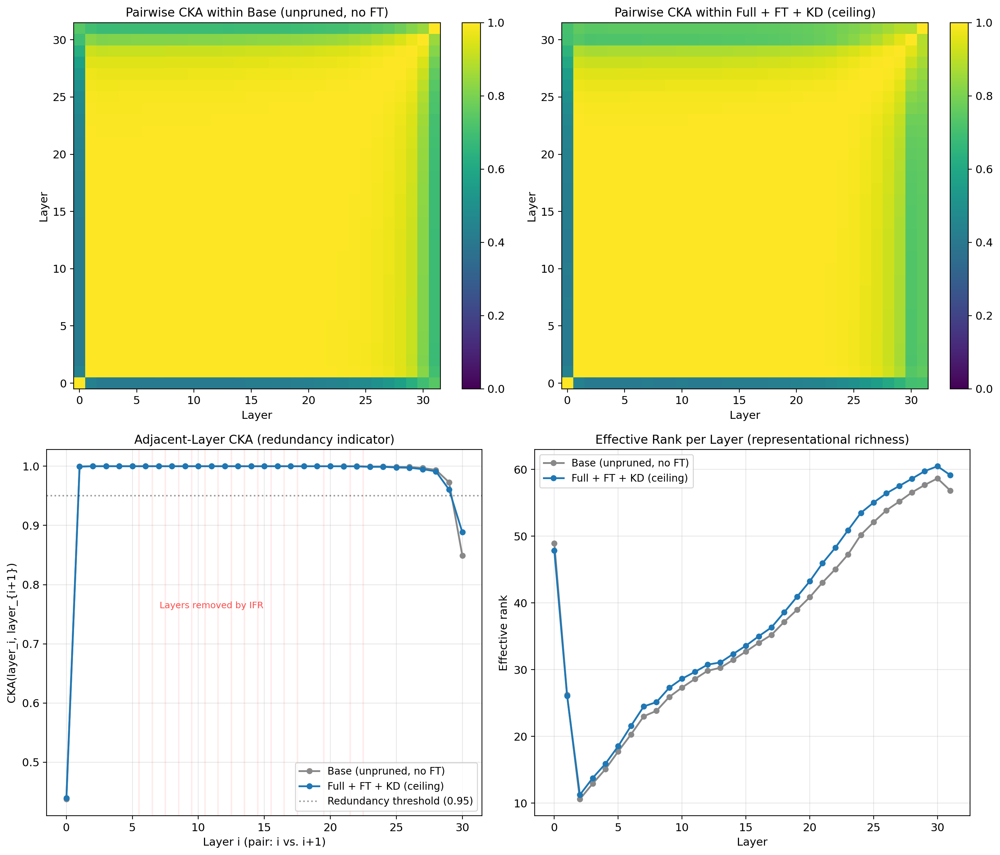

- **Adjacent-layer CKA > 0.99** for every middle-layer pair (1 through 28). Only layers 0 and 31 have meaningfully different representations from their neighbors.
- **Effective rank** grows smoothly from ~10 (layer 1) to ~60 (layer 31). Each layer adds small incremental information.
- Base and full+FT+KD look nearly identical by these measures — FT doesn't fundamentally change the redundancy structure.

**Takeaway:** Consecutive middle layers in Aya 8B do approximately the same thing. Removing 16 of them is mathematically closer to removing 16 near-duplicate vectors than 16 distinct computations. This validates IFR's layer selection.

---

## Finding 3: The pruned model's outputs are broken in specific ways

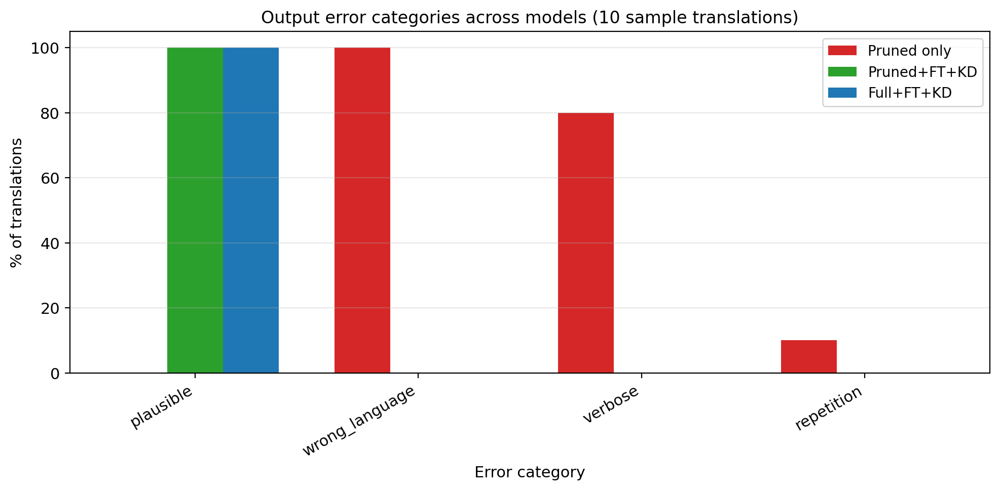

- **100% of pruned-only outputs are wrong language** — the model generates English instead of Spanish
- **80% are verbose** — rambles instead of translating
- **10% repeat**
- Both FT variants produce **100% plausible Spanish**

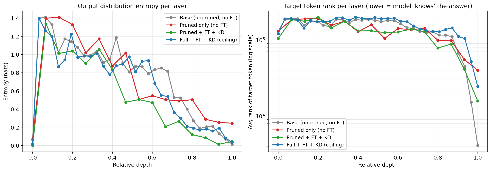

The logit lens shows pruned-only entropy stays elevated at late layers (~0.4-0.5 nats vs ~0.2 for FT variants). The model is **uncertain** about what to output.

---

## Finding 4: LoRA weight changes are small per-layer but distributed

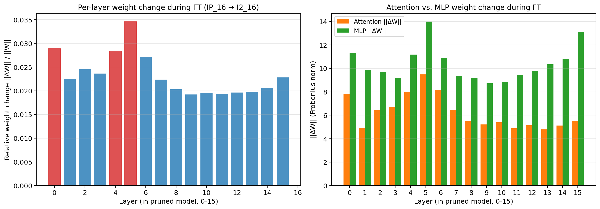

- Average weight change during LoRA FT: **~2-3% per layer** (Frobenius-norm)
- **MLP weights change more than attention weights**
- **Layers 0, 4, 5 change most** — early/interfacing layers

**Important clarification:** This IS LoRA (rank=16 on every q,k,v,o,gate,up,down). The 2-3% change per layer is the merged low-rank update. Individual per-parameter changes are tiny; what matters is that the corrections are *placed at every layer*.

---

## Finding 5: KD is harmful, authentic-only is best

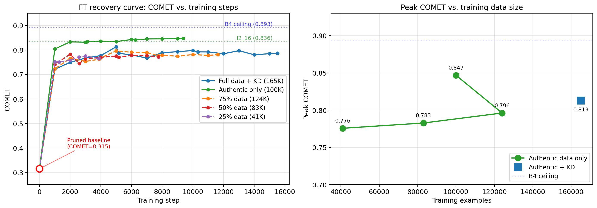

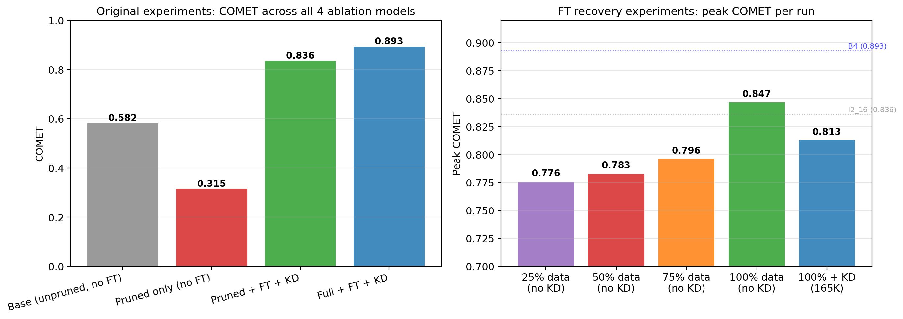

| Run | Peak COMET | Data used |
|-----|-----------|-----------|
| **no_kd (authentic only)** | **0.847** | 100K |
| full_kd (authentic + KD) | 0.813 | 165K |
| frac_0.75 | 0.796 | 124K |
| frac_0.5 | 0.783 | 83K |
| frac_0.25 | 0.776 | 41K |

`no_kd` beats `full_kd` by 0.034 COMET despite using 65K fewer examples. Likely causes:
- **KD data quality**: Aya-32B translations aren't perfect; filtering at COMET ≥ 0.70 still admits subtle errors the student learns.
- **Distribution shift**: KD data was generated from a different distribution than the en-es test set.
- **Overfitting**: `full_kd` peaks at step 5000 then plateaus/declines; `no_kd` keeps improving through epoch 3.

Data efficiency is high: **at step 1000 (~6% of training), COMET already reaches 0.72** — that's 89% of the total recovery. **25% of data hits 0.776** (91% of peak).

---

## Finding 6: Surgical fixes fail — the mechanism is more specific than we thought

This section covers 8 "surgical" attempts to recover quality without full LoRA FT. They progressively isolate what LoRA is actually doing.

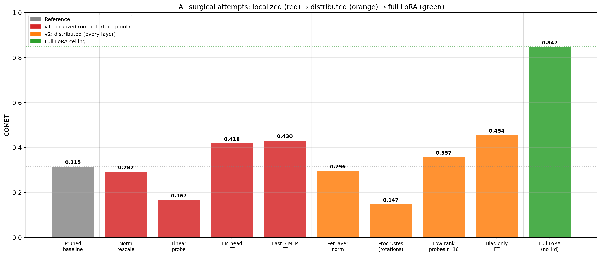

### Series v1: localized fixes (concentrated at one interface point)

| Approach | Location | Trainable params | COMET | vs. baseline |
|----------|----------|-----------------|-------|--------------|
| Pruned baseline | — | 0 | 0.315 | — |
| 1. RMSNorm rescale | Final norm | 1 scalar | 0.292 | −0.023 |
| 2. Linear probe | Pre-LM-head | ~17M (closed-form) | 0.167 | −0.148 |
| 3. LM head + final norm FT | Output layer | 1.05B | 0.418 | +0.103 |
| 4. Last-3 MLPs FT | Last 3 layers | 528M | 0.430 | +0.115 |

All four concentrate the fix at one spot (output region). All fail — top result is 0.43, far below LoRA's 0.85. Takeaway: **localized parameter count doesn't matter**. Even 1.05B params at the output layer can't undo compounded errors from earlier layers.

### Series v2: distributed fixes (corrections at every layer)

| Approach | Correction type | Trainable params | COMET | vs. baseline |
|----------|----------------|-----------------|-------|--------------|
| 5. Per-layer norm rescale | 17 scalars (no training) | 0 | 0.296 | −0.019 |
| 7. Procrustes (orthogonal) | 16 rotations (closed-form) | 0 | 0.147 | −0.168 |
| 8. Rank-16 probes | 16 × rank-16 linear maps (closed-form) | ~2M | 0.357 | +0.042 |
| 6. Bias-only FT | 16 × 4096 biases (SGD) | 66K | **0.454** | **+0.139** |

Now we're distributing across all layers. Results are better than v1 but still top out at 0.45 — still miles from LoRA's 0.85.

**Approach 5 (per-layer norm):** Scale factors clustered around 1.0 (min 0.94, max 1.06) across all 17 norm positions. Magnitudes are essentially identical everywhere. No help.

**Approach 7 (Procrustes):** Per-layer orthogonal rotations compound with depth:

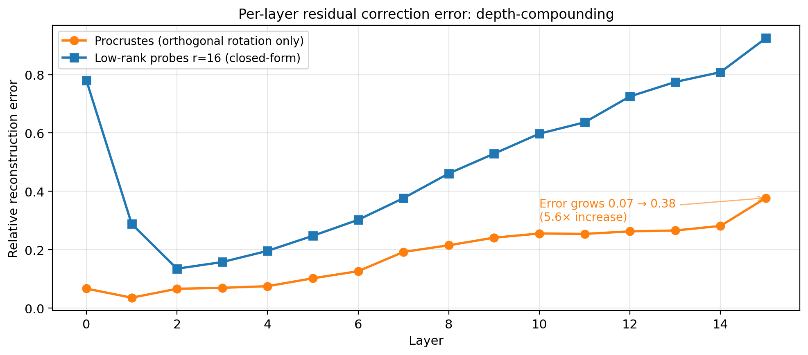

Reconstruction error starts at 0.07 (layer 0) and grows to 0.38 (layer 15) — a **5.6× increase with depth**. Two things are happening:
- Each orthogonal rotation is a constrained fit; it cannot stretch/compress directions
- Applied sequentially, each rotation changes the input to the next layer, breaking the alignment that the next rotation was fit under

**Approach 8 (rank-16 closed-form probes):** This is the real surprise. COMET = 0.357, but **chrF = 0 and BLEU = 0**. The model produces Spanish-flavored content that COMET semantically accepts but that has *zero n-gram overlap* with any reference. Why?

The probes were fit on **prompt-position residuals** (the last token of the translation prompt). During generation, the model visits residuals at *every new token position* — positions the probes never saw. Closed-form fits don't generalize from prompt residuals to generation residuals.

**Approach 6 (bias-only FT):** Best of v2 at 0.454. Just 66K trainable params (vs. LoRA's 21M) but trained with token-level SFT loss. The fact that it beats rank-16 closed-form (0.36) despite having 30× fewer parameters tells us **SGD on the token-level objective is doing real work** — specifically, it sees all autoregressive positions during training, not just prompt positions.

### The refined mechanism — three ingredients LoRA needs

Putting v1 + v2 together, LoRA's success requires **all three**:

1. **Distribution across all layers** (v1 rules out localized; even 1.05B params at the output can't fix this)
2. **Per-projection updates inside attention and MLP** (not just residual offsets — v2 #6 with bias-only gets 0.45, falls short of 0.85)
3. **SGD on token-level loss** (not closed-form matching — v2 #8 with rank-16 closed-form gets 0.36, bias-only FT beats it at 0.45 with 1/30 the params)

The missing piece in every attempt below LoRA was either (1) distribution, (2) per-projection depth, or (3) gradient signal on the full autoregressive trajectory. LoRA has all three: it's rank-16 adapters on every (q, k, v, o, gate, up, down) projection in every layer, trained with SGD on sequence-level loss.

---

## So what does LoRA actually do mechanistically? The "re-wiring" intuition

Putting the findings together:

**Think of it as a building analogy:** The transformer is a building. Each layer is a room. The residual stream is the hallway running through the rooms. The attention and MLP projections (q, k, v, o, gate, up, down) are the doors — they decide what each room reads from the hallway and what it writes back.

- **Pruning removes 16 rooms.** The remaining 16 rooms still have their contents (representations) intact — this is what CKA > 0.99 is telling us. The hallway still runs through them.
- **But the doors are now mis-aligned for the shorter building.** Each surviving room's doors were built assuming the hallway would have specific "flow" at that room (magnitudes, directions, composition from all 32 contributions). With 16 rooms, the hallway flow at each doorway is slightly different, so the readers (q, k, v projections) pick up subtly wrong signal and the writers (o, down projections) write it back wrong.
- **The wrongness compounds autoregressively.** Each generated token's errors propagate through the KV cache to the next token's attention. Small door misalignments at every room → accumulating corruption → the model loses the "speak Spanish, translate faithfully" trajectory despite still *knowing* Spanish.

**LoRA re-aligns the doors.** Rank=16 adapters on every projection = a small, principled adjustment to how each layer reads from and writes to the residual stream. The contents of the rooms don't need to change — the doors just need to be re-fit to the new floor plan.

**Why can it happen fast?** Because you're not re-learning representations, just re-fitting interfaces. 6% of training gets 89% of recovery. 25% of data gets 91% of peak. If FT were re-learning Spanish, it would take much longer and much more data.

## Why each surgical fix failed (in the analogy)

- **Norm rescale (v1 #1, v2 #5):** "Adjust the hallway lighting." But the problem isn't lighting — it's door alignment. No effect.
- **Linear probe (v1 #2):** "Install one big adapter at the last door." Helps for a few specific trips, memorizes training prompts, fails for actual generation trajectories.
- **LM head / last-3 MLP FT (v1 #3, #4):** "Rebuild the front desk." But visitors arrive with cascading confusion from upstream doors. Can't be fixed at the exit.
- **Procrustes (v2 #7):** "Rotate each door by a fixed angle." But doors don't need rotation — they need stretching/compressing specific directions. Orthogonal rotations can't do that, and the errors compound with depth (5.6× growth over 16 layers).
- **Closed-form rank-16 probes (v2 #8):** "Pre-fit doors for typical arrivals." But it fits doors for *prompt positions* and the model actually walks through them at *generation positions* — different incoming flow, probes fail.
- **Bias-only FT (v2 #6):** "Add a constant nudge at every door." Better because it's (a) distributed and (b) SGD-trained on real trajectories, but it can't change what each door reads from the hallway — just offset the outputs. Gets to 0.45 but plateaus.
- **LoRA (the winner):** "Train small rank-16 adjustments on every door's read/write mechanism, end-to-end." All three ingredients: distributed, per-projection, and SGD-optimized. Gets to 0.85.

## Answer to the key question

> If pruned representations are similar yet recovery requires micro-corrections all over the place, why does LoRA actually recover quality?

**Because LoRA is the distributed, per-projection, SGD-trained micro-correction.** All three components matter:

- Remove distribution → localized fixes cap at 0.43 (can't undo compounded errors from earlier layers)
- Remove per-projection depth → layer-output bias cap at 0.45 (can offset outputs but can't re-wire reads)
- Remove SGD → closed-form rank-16 caps at 0.36 (can't generalize from prompt positions to generation positions)

LoRA FT works because it re-fits the *routing* (projections) at every layer with gradient signal that sees the full autoregressive trajectory. The representations don't need to change — the connections do.

---

## Recommendations for the WMT paper

1. **Test `no_kd` on cs-de.** If it replicates (as seems likely), you can drop the Aya-32B KD pipeline entirely — big complexity/cost win.
2. **Consider 1-epoch FT.** Most recovery happens fast; 3 epochs may be overkill given the recovery curve shape.
3. **Try 50% data.** Diminishing returns beyond ~80K examples.
4. **Frame pruning as redundancy removal.** The MI-derived story (adjacent CKA > 0.99, matched-depth CKA > 0.99) is publishable on its own and strengthens the IFR-guidance framing.
5. **Report the surgical-fix negative result.** It's a strong argument for why LoRA (not just FT) is the right recovery mechanism — and it quantifies the value of distributed placement.
6. **The 0.046 ceiling gap** (0.847 vs 0.893) is probably the floor for 50% pruning on this task. Further improvement likely requires different compression (width reduction, distillation into fewer layers, etc.).

## Attention pattern comparison (supplementary)

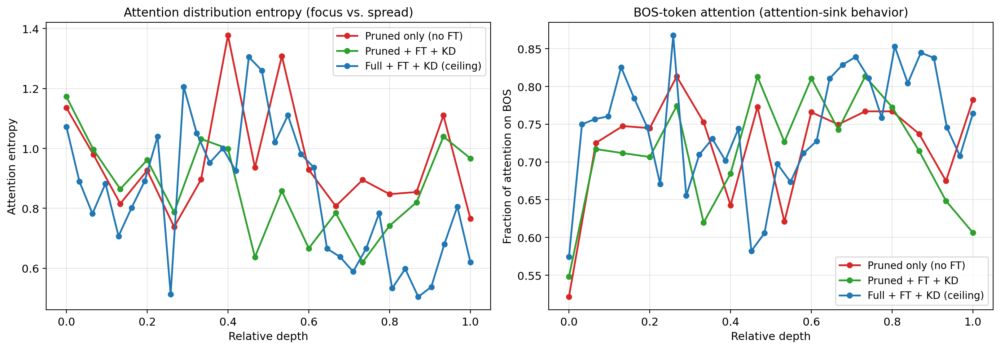

Attention entropy and BOS-sink fraction are **remarkably similar across pruned, pruned+FT+KD, and full+FT+KD** — all three show entropy ~0.8-1.3 nats and BOS fraction ~0.6-0.85 at every layer. This is consistent with the main story: gross attention behavior is preserved after pruning. The damage hides in fine-grained per-position details that these summary statistics average over. Standard attention-inspection tools don't reveal the pruning injury.

## Open questions

- **Does rank-16 specifically matter?** What happens at rank-4, rank-64, rank-256?
- **Which LoRA target modules matter most?** Attention-only vs MLP-only LoRA would isolate the attribution.
- **Generalization:** Does this story hold for cs-de (different morphology, different training distribution)?
- **Fine-grained attention changes:** Aggregate attention stats are unchanged; what specific patterns reorganize during FT? Attention-head-level causal analysis (cf. `~/similarity/circuits/patching.py`) could localize the changes.

## Artifacts

All results and scripts live under `ablation/`:

- `ablation/figures/` — 10 PNG figures
- `ablation/results/` — JSON/npy raw results
- `ablation/results/ft_recovery/{full_kd,no_kd,frac_*}/recovery_curve.json` — recovery curve data per run
- `ablation/results/surgical_fix/surgical_all.json` — surgical fix results
- `ablation/scripts/` — all analysis and training scripts (CPU + GPU)
- `ablation/slurm/` — SLURM wrappers for each experiment
- `ablation/methods.ipynb` — walkthrough of each method with code
